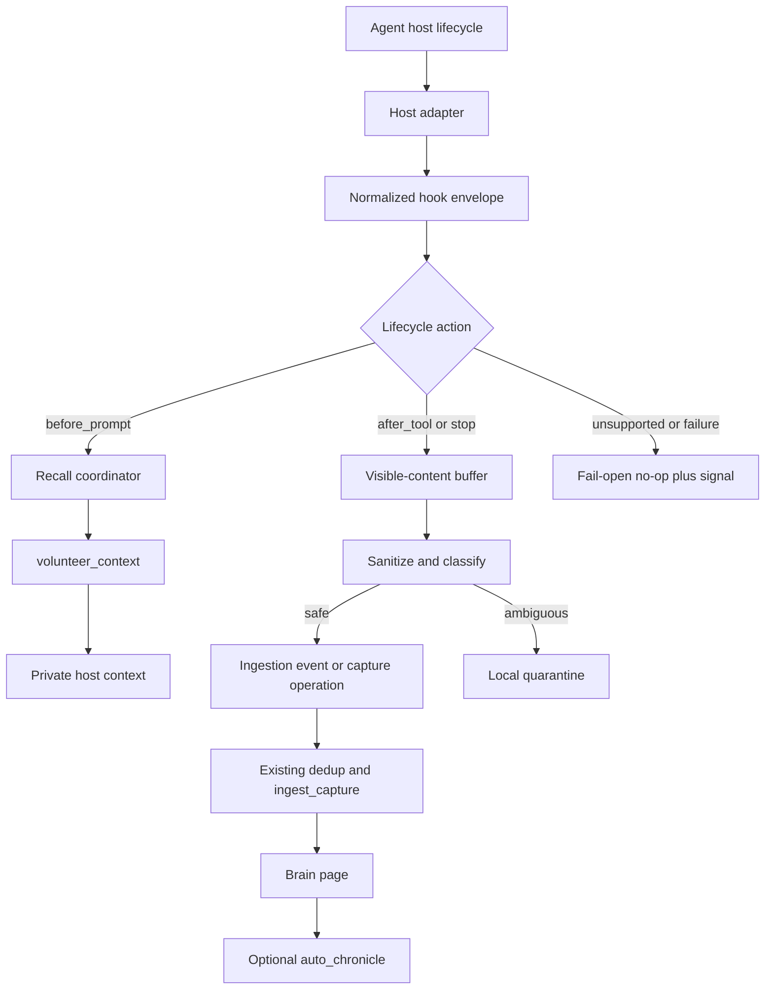

# Ambient Auto-Recall and Auto-Capture Hooks

## Summary

Add a generic, fail-open agent lifecycle hook bundle that turns gbrain's existing retrieval and ingestion primitives into ambient memory. The first adapter targets Codex/OMX lifecycle events without requiring an always-on skill or a new storage subsystem.

## Problem Frame

gbrain already supports push-based recall through retrieval reflexes and `volunteer_context`, runtime capture through ingestion sources, and opt-in timeline projection through Life Chronicle. Agents outside a plugin host still need policy instructions or explicit tool calls to use those capabilities, and gbrain has no generic session lifecycle contract that joins recall before work with capture after visible work.

The contribution should remove the need for a mandatory "search gbrain first" skill. Recall must be private, confidence-gated, bounded, and automatic. Capture must accept only user-visible conversation and tool outcomes, deduplicate repeated lifecycle delivery, quarantine ambiguous candidates, and never persist private reasoning.

## Requirements

### Lifecycle and portability

- R1. A host-neutral hook contract must normalize supported agent lifecycle events before invoking gbrain behavior.
- R2. The first adapter must map available Codex/OMX events to pre-turn recall, visible prompt and post-tool buffering, resumable session-state initialization, and session-stop capture without inventing unsupported host events.
- R3. Missing host capabilities, missing gbrain, timeouts, malformed payloads, and gbrain failures must not block the agent host.
- R4. Installation must preserve existing host configuration and unrelated files, provide a dry-run preview, and support clean removal of only managed artifacts.

### Auto-recall

- R5. Pre-turn recall must reuse `volunteer_context` and its existing source scoping, confidence threshold, pointer limit, suppression, and privacy-fence behavior.
- R6. Recalled context must be injected through a host-private context channel and must not be echoed into the user-visible transcript by the hook.
- R7. A session must suppress repeated recall of the same page unless the normalized subject or retrieval result materially changes.

### Auto-capture

- R8. Capture candidates must contain only user-visible messages and allowed tool outcomes; hidden prompts, chain-of-thought, private reasoning, secrets, and raw hook environment data must be excluded.
- R9. Candidates that pass both privacy safety and durable-value gates must enter gbrain through the existing ingestion/capture path with provenance and stable idempotency keys.
- R10. Ambiguous, potentially sensitive, or safe-but-low-signal candidates must remain outside trusted memory; quarantine records contain only the minimum redacted excerpt needed for local review.
- R11. Repeated `PostToolUse`, `Stop`, retry, or resumed-session delivery must not create duplicate memories.
- R12. Capture must be bounded by size, event count, and execution time so hook latency cannot grow with the full transcript.

### Trust, operations, and compatibility

- R13. Only a trusted local adapter may request quarantine or trusted capture behavior; remote operation callers must remain fail-closed at the existing `OperationContext.remote` boundary.
- R14. Auto-capture must be independently configurable from `auto_chronicle`; Chronicle may project eligible captured pages later but must not become a prerequisite for capture.
- R15. The existing retrieval-reflex recipe must remain compatible, while documentation must make the policy skill optional when ambient hooks are installed.
- R16. The feature must expose local tuning signals for recall, capture, skip, quarantine, duplicate, timeout, and error outcomes without treating best-effort event logs as an audit trail.

## Scope Boundaries

### Included

- A generic lifecycle event envelope and hook runner.
- A Codex/OMX adapter based on events the host currently exposes.
- Private pre-turn recall through existing volunteered-context operations.
- Sanitized post-tool and stop-time capture through existing ingestion primitives.
- Local quarantine, deduplication, bounded buffering, installation, removal, diagnostics, tests, and documentation.

### Deferred

- Native adapters for Claude Code, Gemini CLI, Cursor, and other hosts.
- A literal compaction hook for hosts that do not expose one. The generic contract may represent compaction, but each adapter must declare whether it can deliver it.
- Automatic promotion of quarantined candidates.
- New ranking models, embedding strategies, or recall thresholds.

### Excluded

- Capturing chain-of-thought, hidden system/developer prompts, or private scratch state.
- A daemon, new database, new memory schema, or second retrieval engine.
- Replacing `volunteer_context`, the ingestion daemon, dream synthesis, or Life Chronicle.
- Automatically enabling `auto_chronicle` or incurring Chronicle LLM cost without operator opt-in.

## Key Technical Decisions

- KTD1. **Hooks orchestrate existing operations rather than owning memory semantics:** recall delegates to `volunteer_context`, while capture delegates to the existing ingestion/capture path. This preserves CLI/MCP parity and avoids a parallel memory implementation.
- KTD2. **Use a host-neutral normalized envelope with thin adapters:** the core runner handles lifecycle semantics, safety, deduplication, and dispatch; adapters only translate host payloads and return host-specific private context. This keeps Codex/OMX from becoming the public contract.
- KTD3. **Model lifecycle capabilities explicitly:** the generic contract supports semantic events such as `before_prompt`, `after_tool`, `before_compaction`, and `session_stop`, while each adapter publishes supported mappings. Codex/OMX maps `UserPromptSubmit`, `PostToolUse`, `SessionStart`, and `Stop`; it does not claim a compaction event it cannot observe.
- KTD4. **Default to deterministic capture, not hook-time LLM extraction:** the hook stores a sanitized conversation artifact only when deterministic signals identify durable value, such as explicit decisions, commitments, corrections, stable facts, or an operator capture marker. Existing dream and Chronicle jobs perform later synthesis or timeline extraction. This bounds latency and avoids moving token-spending policy into the hook path.
- KTD5. **Separate privacy safety, durable value, and quarantine:** privacy-safe content is not automatically valuable memory. Safe high-signal content may persist, safe low-signal content stays in an expiring local buffer, and sensitive or uncertain content produces only a minimal redacted quarantine excerpt outside trusted brain pages.
- KTD6. **Use stable event-derived idempotency keys:** derive keys from host, session, normalized event kind, visible-content digest, and lifecycle sequence where available. Do not rely only on the existing 24-hour content hash because hosts can retry events and sessions can legitimately repeat text.
- KTD7. **Private recall is an adapter responsibility with a fail-closed presentation rule:** an adapter must prove it has a non-user-visible injection channel before enabling auto-recall. Unsupported hosts skip recall rather than printing memory into the transcript.
- KTD8. **Installation uses managed, marker-bounded changes and authenticates its local boundary:** extend the integration recipe mechanism only as needed to install owner-only executable hook assets and merge a bounded configuration block. The adapter signs canonical event envelopes with a per-install secret held outside the host repo; the runner rejects trusted capture and quarantine actions when authenticity is absent. Never overwrite a host's complete hook configuration or resolver.
- KTD9. **Hook execution is fail-open and time-budgeted:** each action returns a structured outcome, but host success never depends on gbrain availability. Timeouts, invalid output, and unavailable storage become telemetry and no-op behavior.
- KTD10. **Auto-capture and Chronicle remain separate controls:** `auto_capture` governs session artifact ingestion; `auto_chronicle` governs optional downstream event extraction. This preserves Chronicle's current opt-in cost posture.

## High-Level Technical Design

The normalized envelope carries a schema version, host and adapter identity, semantic event kind, session and event identifiers, timestamp, capability flags, and a bounded visible-content payload. Private host data remains adapter-local and must not enter the normalized capture payload. A canonical envelope digest plus per-install authentication proves that trusted local actions came through the managed adapter rather than arbitrary stdin.

The runner keeps a small persisted local session state containing surfaced recall slugs, buffered visible events, content digests, and processed event keys. `SessionStart` restores state only when authenticated resume metadata names the same host session; otherwise it initializes an empty state. It flushes at bounded checkpoints. An adapter may request an earlier flush before compaction only when the host exposes that lifecycle event.

## Acceptance Examples

- AE1. **Confident private recall**
  - **Covers:** R5, R6, R7
  - **Given:** A user prompt names an entity that resolves above the configured retrieval threshold.
  - **When:** The Codex/OMX `UserPromptSubmit` adapter runs.
  - **Then:** At most the configured number of sanitized pointers enter private model context, and no hook-generated memory text appears in the user-visible transcript.

- AE2. **Low-confidence recall**
  - **Covers:** R3, R5
  - **Given:** A prompt has no entity match above the current threshold.
  - **When:** The pre-turn hook runs.
  - **Then:** It returns successfully without injecting context or invoking a fallback search.

- AE3. **Safe stop-time capture**
  - **Covers:** R8, R9, R11, R12
  - **Given:** A session contains bounded user-visible messages and allowed tool summaries.
  - **When:** `Stop` flushes the buffer twice because the host retries delivery.
  - **Then:** One conversation artifact reaches the existing ingestion handler with provenance, and the retry reports a duplicate outcome.

- AE4. **Sensitive candidate quarantine**
  - **Covers:** R8, R10, R13
  - **Given:** Visible output contains a likely secret or the sanitizer cannot classify a tool result safely.
  - **When:** A capture checkpoint runs.
  - **Then:** No trusted brain page is written, and a minimal redacted excerpt is available through a local-admin-only review surface with a short TTL.

- AE5. **Unavailable gbrain**
  - **Covers:** R3, R16
  - **Given:** The gbrain operation exceeds the hook time budget or is unavailable.
  - **When:** Any mapped lifecycle event runs.
  - **Then:** The host event succeeds, the adapter emits an error or timeout signal, and no partial trusted capture is created.

- AE6. **Unsupported compaction event**
  - **Covers:** R1, R2
  - **Given:** The generic contract supports `before_compaction`, but the Codex/OMX adapter does not receive that event.
  - **When:** Adapter capabilities are inspected.
  - **Then:** Compaction capture is reported as unsupported and stop-time capture remains active.

- AE7. **Safe but low-value conversation**
  - **Covers:** R9, R10
  - **Given:** A visible conversation contains no sensitive material but records no decision, commitment, correction, stable fact, or explicit capture marker.
  - **When:** A capture checkpoint classifies it.
  - **Then:** It does not become a trusted page and expires from the bounded local buffer.

## Implementation Units

### U1. Define the normalized lifecycle contract and safety policy

- **Goal:** Add the versioned event, capability, outcome, capture-candidate, and local session-state contracts that all adapters use.
- **Requirements:** R1, R3, R8, R12, R13
- **Files:** `src/core/hooks/types.ts`, `src/core/hooks/policy.ts`, `src/core/hooks/session-state.ts`, `test/ambient-hooks-types.test.ts`
- **Patterns:** Follow the public versioned ingestion types in `src/core/ingestion/types.ts`; keep runtime validation at the trust boundary; use `gbrainPath` for local state.
- **Approach:** Define semantic lifecycle kinds independently of host event names. Separate visible capture fields from adapter-private fields at the type and validation layers. Add explicit size, event-count, timeout, resume-state, authenticity, and expiry defaults.
- **Test Scenarios:** Accept the minimum valid authenticated envelope; reject unsupported schema versions, invalid signatures, and oversized payloads; strip unknown/private fields; restore only matching resumed sessions; expire stale state; prove remote contexts cannot assert trusted or quarantine authority.
- **Verification:** Unit tests show malformed and oversized events return structured no-op outcomes without uncaught exceptions.

### U2. Implement the recall coordinator

- **Goal:** Convert `before_prompt` events into bounded private context by reusing the existing volunteer operation.
- **Requirements:** R3, R5, R6, R7
- **Files:** `src/core/hooks/recall.ts`, `src/core/operations.ts`, `test/ambient-hooks-recall.test.ts`
- **Patterns:** Reuse `src/core/context/volunteer.ts`, `src/core/context/reflex.ts`, and the `volunteer_context` operation contract; preserve source scoping and privacy-fence stripping.
- **Approach:** Pass the bounded recent-turn window into the existing operation, preserve its confidence gate and pointer cap, and maintain per-session surfaced-slug suppression. Return a generic private-context result that adapters must explicitly support.
- **Test Scenarios:** Confident match injects bounded pointers; low-confidence match is empty; repeated entity is suppressed; source scope is honored; disabled retrieval reflex remains disabled; volunteer failure and timeout are fail-open; no takes/facts fence content is returned.
- **Verification:** Recall tests assert operation parity rather than duplicating retrieval logic in the hook runner.

### U3. Implement sanitized, idempotent capture dispatch

- **Goal:** Turn bounded visible lifecycle content into safe ingestion candidates, quarantine uncertain content, and dispatch safe candidates through the existing capture pipeline.
- **Requirements:** R3, R8, R9, R10, R11, R12, R13, R14
- **Files:** `src/core/hooks/capture.ts`, `src/core/hooks/sanitize.ts`, `src/core/hooks/quarantine.ts`, `src/core/ingestion/types.ts`, `src/core/minions/handlers/ingest-capture.ts`, `test/ambient-hooks-capture.test.ts`
- **Patterns:** Reuse `IngestionEvent`, the ingestion daemon's validation, `src/core/ingestion/dedup.ts`, and capture provenance conventions from `src/commands/capture.ts`.
- **Approach:** Buffer only normalized visible content. Apply separate privacy-safety and durable-value classifiers before hashing. Derive a stable lifecycle idempotency key and carry it as provenance so retries are rejected before page creation. Store only minimal redacted excerpts for ambiguous candidates in a bounded local quarantine with restrictive permissions, a short TTL, and secure purge behavior; never retain the suspected sensitive body.
- **Test Scenarios:** Safe high-value conversation persists once; safe low-signal conversation expires without persistence; duplicate event and duplicate stop flush do not persist twice; likely secrets yield only minimal redacted quarantine excerpts; hidden/private fields never reach a candidate; oversized content truncates predictably; empty or tool-only noise is skipped; Chronicle remains disabled unless separately configured; handler failure leaves no partial trusted page.
- **Verification:** Behavioral tests inspect emitted ingestion events and resulting pages, not source text, and prove that capture does not depend on `auto_chronicle`.

### U4. Build the generic runner and Codex/OMX adapter

- **Goal:** Wire normalized recall and capture actions to real host lifecycle events with capability reporting and fail-open exit behavior.
- **Requirements:** R1, R2, R3, R6, R11, R12, R16
- **Files:** `recipes/ambient-memory-hooks/code/runner.ts`, `recipes/ambient-memory-hooks/code/adapters/codex-omx.ts`, `recipes/ambient-memory-hooks/code/bin/gbrain-hook`, `test/ambient-hooks-codex-omx.test.ts`
- **Patterns:** Follow current OMX managed hook events and existing gbrain CLI JSON output conventions. Keep the recipe wrapper thin and core behavior in `src/core/hooks/`.
- **Approach:** Map `SessionStart` to authenticated initialization or restoration of matching session state, `UserPromptSubmit` to private recall plus sanitized visible-user-message buffering, `PostToolUse` to allowed visible outcome buffering, and `Stop` to final capture. Declare `before_compaction` unsupported until the host exposes it. Authenticate canonical envelopes, apply a hard timeout, and convert every failure into a zero exit plus structured diagnostic.
- **Test Scenarios:** Each supported host event maps to one semantic event; user prompts are buffered exactly once; unknown events no-op; missing private injection capability disables recall; invalid authenticity, malformed stdin, and unavailable CLI exit successfully without trusted writes; resumed sessions restore only their own state; `Stop` retry is idempotent; raw environment variables and hook payload extras are not captured.
- **Verification:** Fixture-driven adapter tests exercise exact host payload shapes and assert stdout/stderr contracts and exit status.

### U5. Add safe recipe installation, removal, and diagnostics

- **Goal:** Ship ambient hooks as a copy-into-host-repo integration without overwriting existing host policy or hook configuration.
- **Requirements:** R4, R15, R16
- **Files:** `recipes/ambient-memory-hooks.md`, `recipes/ambient-memory-hooks/install/manifest.json`, `src/commands/integrations.ts`, `test/integrations-install.test.ts`, `test/ambient-hooks-install.test.ts`
- **Patterns:** Extend the existing `copy-into-host-repo` manifest behavior used by `recipes/retrieval-reflex/install/manifest.json`; retain path-containment and managed-file checks.
- **Approach:** Add manifest support for executable files and marker-bounded host configuration fragments only if the current installer cannot express them. Installation must preview changes, create owner-only assets and a per-install secret outside the host repo, reject marker conflicts or paths outside the host repo, preserve unrelated configuration, and record managed artifacts for removal. Diagnostics report adapter capabilities and recent outcome counts without exposing captured content. Quarantine listing, inspection, and purge remain local-admin-only and are not exposed through MCP or remote operations.
- **Test Scenarios:** Fresh install, dry run, idempotent reinstall, secret rotation, unsigned or incorrectly signed event, conflicting existing marker, pre-existing unrelated hooks, owner-only executable mode, traversal attempt, clean uninstall, local-only quarantine access, and uninstall after user edits outside the managed block.
- **Verification:** Installer tests prove byte-for-byte preservation outside managed artifacts and no resolver row is required to activate recall.

### U6. Document controls, migration, and operational behavior

- **Goal:** Explain what gbrain already emits, how ambient hooks differ, and how operators enable, tune, inspect, quarantine, and disable the feature.
- **Requirements:** R4, R14, R15, R16
- **Files:** `docs/guides/ambient-memory-hooks.md`, `docs/guides/push-context.md`, `recipes/retrieval-reflex.md`, `docs/architecture/KEY_FILES.md`, `CHANGELOG.md`, `llms.txt`, `llms-full.txt`
- **Patterns:** Keep `docs/guides/push-context.md` canonical for retrieval semantics; regenerate LLM-facing docs through the existing documentation build.
- **Approach:** Distinguish ingestion event emission, Chronicle auto-emission, auto-capture, and auto-recall. Document private-context requirements, default limits, fail-open behavior, local-admin-only quarantine review, PGLite limitations, Chronicle cost, adapter capability gaps, durable-value criteria, and removal of the always-search skill requirement.
- **Test Scenarios:** Documentation examples use generic placeholders; documented commands and config keys match implemented help; generated LLM docs are current.
- **Verification:** Documentation checks and generated-file diff confirm the feature is discoverable without implying that Chronicle or compaction support is automatic.

### U7. Run cross-engine and local shipping verification

- **Goal:** Prove the hooks preserve gbrain operation contracts, privacy boundaries, and supported engine behavior.
- **Requirements:** R3, R5, R8, R9, R11, R13
- **Files:** `test/e2e/ambient-hooks-postgres.test.ts`, existing focused tests touched by U1-U6
- **Patterns:** Follow the existing PGLite/unit and PostgreSQL E2E split used by volunteer-context and ingestion tests.
- **Approach:** Cover recall and capture through public operation/ingestion seams on both supported engines where behavior crosses storage. Include regression coverage for disabled reflex, remote trust rejection, duplicate delivery, and fire-and-forget failure.
- **Test Scenarios:** PostgreSQL safe capture and duplicate retry; source-scoped recall; remote caller trust escalation rejection; PGLite execution without a second long-lived watcher connection; full local CI and generated-doc checks.
- **Verification:** Focused tests pass on both engines, then the repository's local shipping gate passes with no unrelated `.gitignore` mutation included.

## System-Wide Impact

- **Operation parity:** Hook recall must enter through the same `volunteer_context` operation used by CLI and MCP. Any new operation needed for capture or quarantine must be defined in `src/core/operations.ts` and receive parity coverage.
- **Trust boundary:** Adapter-local authority cannot become a client-controlled request field. `OperationContext.remote` remains the final guard against remote trust escalation.
- **Data lifecycle:** Safe captures become normal brain pages with provenance and existing retention behavior. Quarantine has a separate bounded local lifecycle and is never indexed or recalled.
- **Privacy:** Sanitization occurs before persistence, hashing, diagnostics, or quarantine metadata. Retrieval continues to strip private fences before context injection.
- **Performance:** Pre-turn recall and post-turn capture add bounded hook latency. Hard deadlines and fail-open outcomes prevent gbrain from delaying the host indefinitely.
- **Engine behavior:** The hook must not open a persistent PGLite watcher connection. Short-lived operation calls preserve the current guidance that ambient reflex is preferred over `gbrain watch`.
- **Downstream synthesis:** Dream and Chronicle may process safe captured pages later under their existing controls. Hook installation must not silently enable LLM-backed extraction.
- **Observability:** Best-effort outcome signals support tuning but are not an audit log. Diagnostics must expose counts and reasons, not captured content.

## Risks and Mitigations

| Risk | Mitigation |
| --- | --- |
| Private reasoning or secrets enter durable memory | Construct capture payloads from an allowlist of visible fields, sanitize before hashing, quarantine uncertainty, and test forbidden-field non-propagation. |
| Host retries create duplicate pages | Use stable lifecycle idempotency keys in addition to existing content-hash deduplication and test repeated post-tool and stop delivery. |
| Hook installation damages existing configuration | Use dry-run plus marker-bounded merges, reject ambiguous conflicts, preserve unrelated bytes, and track only managed artifacts for removal. |
| Recall leaks into the visible transcript | Require an adapter-declared private injection capability; otherwise skip auto-recall. |
| Hook latency degrades interaction | Bound turns, events, bytes, and wall-clock time; use deterministic capture; fail open on timeout. |
| Codex/OMX lifecycle changes | Keep translation in a thin adapter with fixture tests and capability reporting; do not encode host event names in the core contract. |
| Quarantine becomes a sensitive shadow store | Never retain the suspected sensitive body; keep only a minimal redacted excerpt with owner-only access, item/byte/age caps, local-admin-only review, and secure purge. |
| Chronicle unexpectedly spends LLM tokens | Keep `auto_capture` and `auto_chronicle` independent and leave Chronicle off by default. |
| PGLite connection contention | Use short-lived operation invocations and avoid the transcript-streaming watcher path. |
| Telemetry is mistaken for compliance evidence | Label hook outcomes as best-effort tuning signals and avoid audit claims in docs and diagnostics. |

## Documentation and Rollout Notes

- Stage opt-in rollout: recall-only dogfood first, then quarantine-only capture, then trusted auto-capture after explicit quality gates pass.
- Default recall to the existing confidence threshold and pointer cap rather than adding hook-specific tuning knobs.
- Default capture to conservative visible-content allowlists and quarantine-on-uncertainty.
- Provide independent switches for recall, capture, tool-outcome capture, and Chronicle projection.
- Document how to inspect adapter capabilities before enabling private recall.
- Mark the existing retrieval-reflex policy skill as optional for hosts using ambient hooks; do not remove the recipe because non-hook hosts still need it.
- Include a rollback path that disables the managed hook block before removing installed assets.
- Dogfood gates must cover recall relevance, p95 hook latency, immediate disable rate, retained enablement, duplicate rate, quarantine promotion rate, captured-page retrieval contribution, and sampled memory-noise rate. Expansion and rollback thresholds are fixed before each stage begins.

## Sources

- `docs/guides/push-context.md` documents the existing `reflex`, `op`, and `watch` recall channels and their confidence, suppression, and privacy behavior.
- `src/core/context/volunteer.ts` and `src/core/context/reflex.ts` are the canonical recall implementation seams.
- `src/core/operations.ts` is the contract-first operation boundary shared by CLI and MCP.
- `src/core/ingestion/types.ts`, `src/core/ingestion/daemon.ts`, and `src/core/minions/handlers/ingest-capture.ts` define emission, validation, deduplication, and capture dispatch.
- `src/core/chronicle/backstop.ts`, `src/core/chronicle/eligibility.ts`, and `src/core/chronicle/config.ts` show that Chronicle auto-emission is downstream, eligibility-gated, fail-open, and opt-in because it spends LLM tokens.
- `src/core/facts/meta-hook.ts` and `src/mcp/dispatch.ts` provide precedent for best-effort automatic memory injection on MCP responses.
- `src/commands/integrations.ts` and `recipes/retrieval-reflex/install/manifest.json` define the current host-recipe installation boundary.
- `test/volunteer-context.test.ts`, `test/retrieval-reflex.test.ts`, `test/integrations-install.test.ts`, and `test/e2e/volunteer-context-postgres.test.ts` provide the closest behavioral and cross-engine test patterns.
